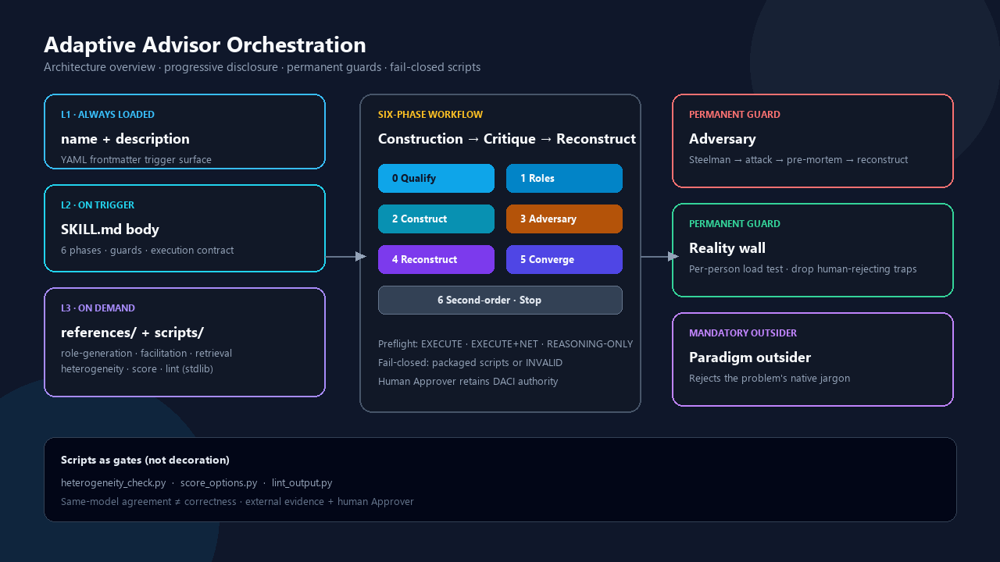
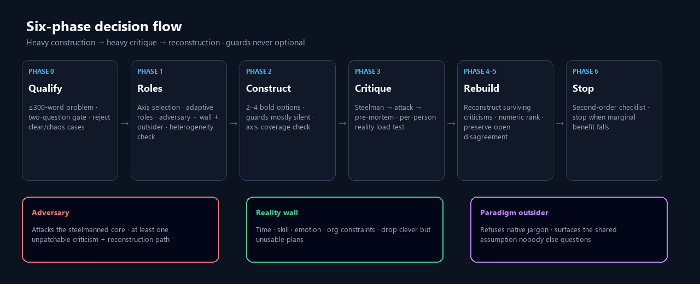

# Adaptive Advisor Orchestration

[English](#adaptive-advisor-orchestration) · [中文](#adaptive-advisor-orchestration-中文)

[](./LICENSE)
[](./adaptive-advisor-orchestration/SKILL.md)
[](./adaptive-advisor-orchestration/scripts)
[](#architecture)

> Let the problem grow its own review team — but always keep three roles that do not depend on the problem: an **adversary**, a **reality wall**, and a **paradigm outsider**.

Current package: **v0.3.1** (gated speaker card; outsider may reject jargon, not the speaker).

A Cursor / Claude **Agent Skill** for decisions where a single confident answer is the wrong product: architecture and RFC choices, methodology design, policy trade-offs, high-risk migrations, and any question with competing domains or conflicting stakeholders.

---

## Why this exists

Most “multi-role” prompts collapse into one prior wearing different hats. This skill treats that failure mode as the main enemy:

1. **Heterogeneous critique** beats self-review — only when red lines and criteria actually differ.
2. The **adversary is structural**, never optional decoration.
3. **Final authority stays with the human Approver** (DACI).
4. Roles are **thinking structures**, not credentials. High-risk domains still need real expert sign-off.

The execution contract is fail-closed: if tools exist, packaged scripts must run and show exit codes; if they do not, the run must say `REASONING-ONLY` loudly instead of looking executed.

---

## Architecture

<p align="center">
  
</p>

<p align="center">
  
</p>

<details>
<summary>Source diagrams (SVG / HTML)</summary>

- [`docs/assets/architecture-overview.svg`](docs/assets/architecture-overview.svg)
- [`docs/assets/architecture-overview.html`](docs/assets/architecture-overview.html)
- [`docs/assets/phase-flow.svg`](docs/assets/phase-flow.svg)
- [`docs/assets/phase-flow.html`](docs/assets/phase-flow.html)

</details>

### Progressive disclosure

| Layer | What loads | When |
|---|---|---|
| L1 | `name` + `description` (YAML frontmatter) | Always (trigger surface) |
| L2 | `SKILL.md` body | On skill trigger |
| L3 | `references/` + `scripts/` | On demand / at gates |

This matches the [Agent Skills](https://www.anthropic.com/engineering/equipping-agents-for-the-real-world-with-agent-skills) pattern: keep the entry thin; deepen only when needed. **No README inside the skill folder** — humans read this repo README; agents load `SKILL.md`.

### Permanent guards (never optional)

| Guard | Job |
|---|---|
| **Adversary** | Roster review → steelman → structural attack → pre-mortem → reconstruction path |
| **Reality wall** | Per-person load test (time, skill, emotion, org) · drop human-rejecting “clever” plans |
| **Paradigm outsider** | Rejects native jargon, not the speaker · names the shared assumption nobody challenges |

---

## Install

### Cursor

1. Clone this repository (or download the `adaptive-advisor-orchestration/` folder).
2. Copy the skill folder into your Cursor skills directory, for example:

```bash
# Windows (PowerShell)
Copy-Item -Recurse .\adaptive-advisor-orchestration $env:USERPROFILE\.cursor\skills\

# macOS / Linux
cp -R adaptive-advisor-orchestration ~/.cursor/skills/
```

3. Restart Cursor or reload skills, then invoke with `/adaptive-advisor-orchestration` or describe a multi-perspective decision.

### Claude / other Agent Skills hosts

Place the `adaptive-advisor-orchestration/` directory where your host expects skills (a folder containing `SKILL.md`). See your product’s skill install docs.

**Requirements for full EXECUTE mode:** Python 3 + ability. Scripts use the **standard library only** (no `pip install`).

---

## Quick start

Ask a decision that has a real trade-off, for example:

```text
/adaptive-advisor-orchestration
Should we ship feature X behind a flag this sprint, or wait for the redesign?
Constraints: two absent stakeholders, compliance review next month.
```

Bare invocation runs **Standard depth + EXECUTE** (scripts actually run; no “strict” flag needed). Full depth is opt-in for high stakes. To lighten a run, say so explicitly, e.g. `relaxed: prioritize speed`.

### Preflight states

| State | Meaning |
|---|---|
| `EXECUTE` | Code tools available → packaged scripts **must** run |
| `EXECUTE+NET` | Code + web → reality wall / outsider ground claims in real searches |
| `REASONING-ONLY` | No tools → label loudly, downgrade confidence, mark `prior-only — unverified` |

---

## When to use / not use

**Use when** there is disagreement inside the problem: competing domains, conflicting interests, or a seductive answer that hides a trade-off.

**Do not use when**

- a recognized best practice already exists **and** risk/uncertainty are both low
- you are in a crisis / outage (act first)
- ≤3 perspectives cover it and the root cause is known
- there are no absent humans and no buried dilemma — prefer a plain competent answer

---

## Repository layout

```text
Adaptive-Advisor-Orchestration/
├─── README.md                          # humans (EN + ZH)
├─── LICENSE                            # MIT
├─── docs/assets/                       # architecture diagrams (PNG + SVG + HTML)
└─── adaptive-advisor-orchestration/    # Agent Skill package v0.3.1 (no nested README)
    ├─── SKILL.md
    ├─── routing.json                   # machine-checkable depth / agent / ref ceilings
    ├─── evals/
    │   ├─── evals.json                 # mechanical routing tasks
    │   └─── fixtures/                  # gate-script fixtures
    ├─── scripts/
    │   ├─── heterogeneity_check.py
    │   ├─── score_options.py
    │   ├─── lint_output.py
    │   ├─── eval_skill.py              # offline eval harness (author path)
    │   └─── README.md
    └─── references/
        ├─── role-generation.md
        ├─── facilitation.md
        ├─── retrieval-and-evidence.md
        ├─── execution-substrate.md
        ├─── prompts.md
        ├─── worked-examples.md
        └─── skill-handoff.md           # refuse-and-route to sibling skills
```

---

## Scripts (gates, not decoration)

Call the **packaged** files. Inline `python -c` rewrites that print a fake exit code are treated as **INVALID**.

| Script | Phase | Purpose |
|---|---|---|
| `heterogeneity_check.py` | End of Phase 1 | Catch pseudo-diversity (token overlap, veto collision, missing outsider) |
| `score_options.py` | Phase 5 | Weighted / RICE ranking for the Approver |
| `lint_output.py` | Before finalize | Phantom citations, unanchored conclusions, missing honesty sections |
| `eval_skill.py` | Author / CI | Mechanical routing eval vs `evals/evals.json` (not a live panel) |

```bash
python adaptive-advisor-orchestration/scripts/heterogeneity_check.py roster.json
python adaptive-advisor-orchestration/scripts/score_options.py options.json
python adaptive-advisor-orchestration/scripts/lint_output.py deliberation.md --interest-heavy
python adaptive-advisor-orchestration/scripts/eval_skill.py adaptive-advisor-orchestration
```

Windows PowerShell 5.1 does not support `&&`. Chain with `; if ($LASTEXITCODE -ne 0) { exit $LASTEXITCODE }` — see `scripts/README.md`.

---

## Honesty limits

- Output is multi-perspective reasoning, **not** proven reality. Do not read “ranked #1” as “optimal.”
- Same-model multi-agent gives **context isolation and real tool execution**, not repaired diversity. Same-model agreement is evidence of a shared prior only.
- Legal, clinical, financial, and compliance conclusions stay **blocked** until a named human expert reviews them.
- The human Approver owns the final call.

---

## License

[MIT](./LICENSE) © 2026 hisonWarren

---

# Adaptive Advisor Orchestration（中文）

[English](#adaptive-advisor-orchestration) · [中文](#adaptive-advisor-orchestration-中文)

> 让问题长出自己的评审团——但永远固定三个不随问题变化的角色：**对抗者**、**现实承重墙**、**范式局外人**。

当前包：**v0.3.1**（门控说话人卡片；可及性改术语，不改说话人）。

面向 Cursor / Claude 的 **Agent Skill**：当你真正需要的不是“一个自信答案”，而是可审计、可决策、诚实标出边界的审议时使用——架构与 RFC、方法学设计、政策权衡、高风险迁移，以及存在竞争领域或冲突利益方的问题。

## 为何需要它

多数“多角色”提示会塌缩成同一先验的不同帽子。本技能把伪多样性当作首要失败模式：

1. **异质批评**优于自我复核——前提是红线与评价标准真的不同。
2. **对抗者是结构位**，绝非装饰。
3. **最终裁决权留在人类 Approver**（DACI）。
4. 角色是**思维结构**，不是资质背书；高风险领域仍需真人专家签字。

执行契约是失败即关闭：有工具就必须跑打包脚本并展示退出码；没有工具就必须大声标注 `REASONING-ONLY`，而不是伪装成已执行。

## 架构

见上方英文区两张图（同一资源，双语共用）：

- 总览：`docs/assets/architecture-overview.png`
- 阶段流：`docs/assets/phase-flow.png`

源文件：`docs/assets/*.svg` / `*.html`。

### 渐进披露

| 层 | 加载内容 | 时机 |
|---|---|---|
| L1 | `name` + `description` | 始终（触发面） |
| L2 | `SKILL.md` 正文 | 技能触发后 |
| L3 | `references/` + `scripts/` | 按需 / 门禁处 |

符合 Agent Skills 约定：**技能包内不放给人看的 README**；人读仓库 README，代理读 `SKILL.md`。

### 永久守门（不可省略）

| 角色 | 职责 |
|---|---|
| **对抗者** | 名单审查 → Steelman → 结构性攻击 → 预验尸 → 重构方向 |
| **现实承重墙** | 按受影响真人做负载测试 · 放弃“聪明但人扛不住”的方案 |
| **范式局外人** | 拒绝母语术语，不改说话人 · 点出无人挑战的共享假设 |

## 安装

### Cursor

```powershell
Copy-Item -Recurse .\adaptive-advisor-orchestration $env:USERPROFILE\.cursor\skills\
```

```bash
cp -R adaptive-advisor-orchestration ~/.cursor/skills/
```

完整 `EXECUTE` 模式需要 Python 3；脚本仅依赖标准库。

## 快速开始

```text
/adaptive-advisor-orchestration
本周是否应将功能 X 放在特性开关后发布，还是等改版？
约束：两位缺席干系人；下月合规评审。
```

裸调用默认跑 Standard 深度 + EXECUTE（脚本真跑，非 Full 深度）。Full 仅在高风险或用户明确要求时开启。若要减负，须显式声明，例如：`relaxed: prioritize speed`。

| 预检状态 | 含义 |
|---|---|
| `EXECUTE` | 有代码工具 → **必须**跑打包脚本 |
| `EXECUTE+NET` | 有代码+联网 → 现实墙/局外人须用真实检索锚定 |
| `REASONING-ONLY` | 无工具 → 大声标注并降置信度 |

## 何时用 / 何时不用

**适用**：问题内部存在真实分歧（领域冲突、利益冲突、或诱人答案掩盖权衡）。

**不适用**：已有公认最佳实践且风险与不确定性都低；危机中应先行动；≤3 个视角已够且根因已知；无缺席真人且无隐藏两难——直接给一个能干的答案即可。

## 仓库结构

见上方英文区目录树。技能包路径：`adaptive-advisor-orchestration/`。

## 脚本门禁

必须调用 `scripts/` 下的真实文件；用内联 `python -c` 伪造退出码视为 **INVALID**。

| 脚本 | 阶段 | 作用 |
|---|---|---|
| `heterogeneity_check.py` | Phase 1 末 | 伪多样性门禁 |
| `score_options.py` | Phase 5 | 加权 / RICE 排序（输入 Approver，非裁决） |
| `lint_output.py` | 定稿前 | 幽灵引用、无锚结论、缺失诚实声明 |
| `eval_skill.py` | 作者 / CI | 对 `evals/evals.json` 做机械路由评测（不是现场六阶段） |

## 诚实边界

- 产出是多视角推理，**不是**已验证现实；排名第一 ≠ 最优。
- 同模型多智能体买到的是上下文隔离与真实执行，**修不了共享先验**。
- 法务 / 临床 / 金融 / 合规结论在具名真人专家复核前保持 **blocker**。
- 最终决策权始终在人类 Approver。

## 许可证

[MIT](./LICENSE) © 2026 hisonWarren
